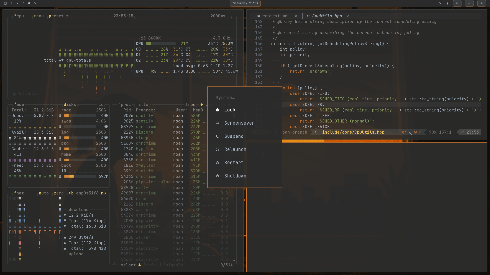
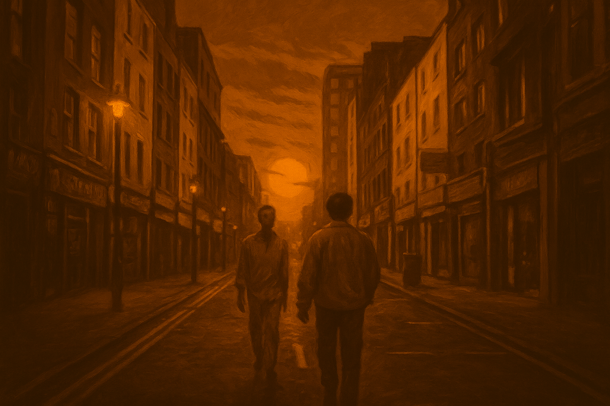

# Omarchy Darcula Theme

A JetBrains Darcula-inspired theme pack for [Omarchy.org](https://omarchy.org) that keeps terminals, bars, notifications, and editors in sync with the classic charcoal base, warm orange keywords, and powder-blue selections.

  

## Palette
| Role | Hex |
| --- | --- |
| Background | `#2B2B2B` |
| Surface | `#3C3F41` |
| Foreground | `#A9B7C6` |
| Muted Text | `#808080` |
| Accent Orange | `#CC7832` |
| Accent Yellow | `#FFD760` |
| Accent Blue | `#6897BB` |
| Accent Green | `#6A8759` |

## Background Set

  
  
  

  
  
  

  

## Usage
1. Copy this theme directory into `~/.config/omarchy/themes/` you can just git clone
2. Set it as your active theme via the omarchy menu i guess you know how

